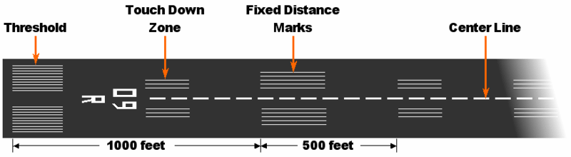
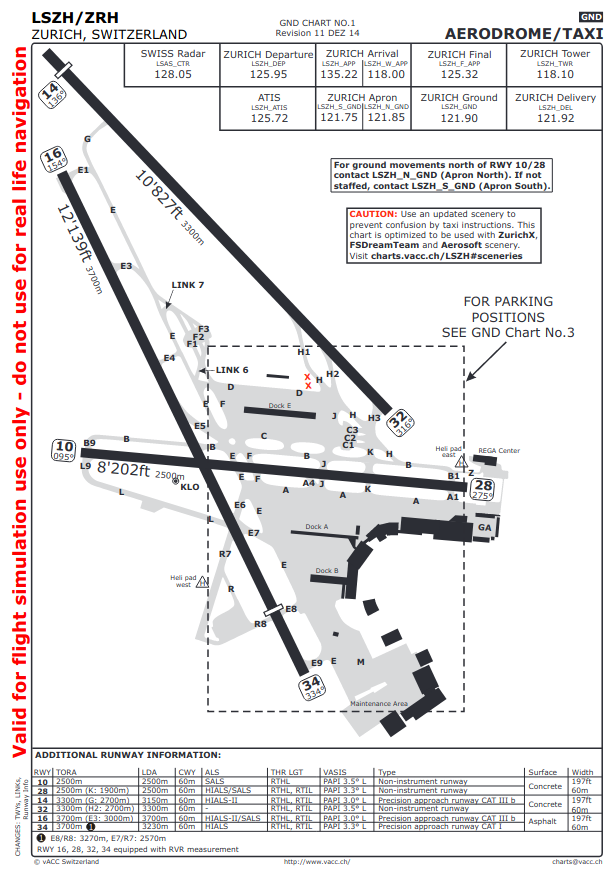
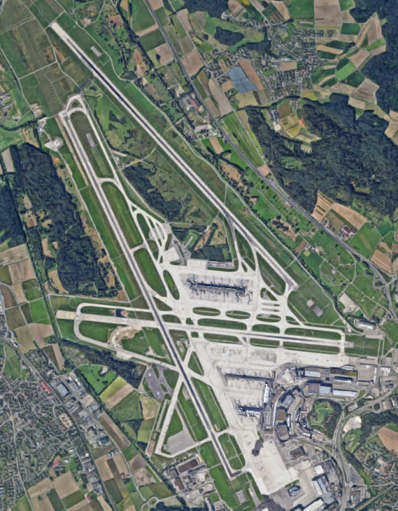
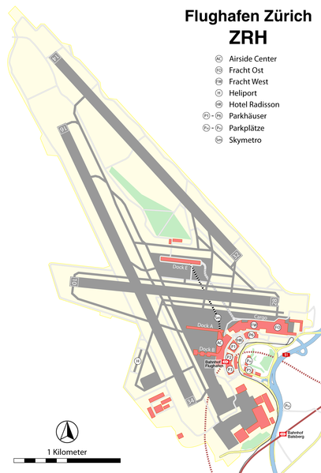
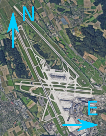

# Détecter l'orientation des pistes

Ce travail est évalué et devra être rendu lors de la semaine sans cours.
À savoir le **24 juin 2021**.
Le non respect des consignes entraînera des pénalités dans votre note.
Pour réaliser ce travail, vous pouvez utiliser les outils offerts par la librairie `scikit` image, mais limitez-vous aux approches étudiées en cours.

Votre travail consiste à automatiquement identifier le numéro des pistes d'une photo aérienne (ou satellite) de l'aéroport de Zürich.

## Les pistes d'un aérodrome

Une piste est identifiée par un numéro à deux chiffres indiquant la déclinaison magnétique (càd. son orientation par rapport au nord magnétique sur le plan horizontal) en dizaines de degrés.
Le schéma suivant illustre l'utilisation des différents marqueurs sur les pistes, dont le fameux numéro:



Fig.1 - Source de l'image: `wikipedia.org`.

où l'on constate qu'il s'agit de la piste 09 (R).

Comme le numéro donne la déclinaison en dizaines de degrés, ceci implique que cette piste possède une déclinaison dans l'intervalle compris entre 85 à 94 degrés (inclus).
Une piste dont l'orientation est de 84 degrés sera notée piste 08 et non 09.
Notez que la déclinaison précise (au degré) est connue dans les documents/cartes fournies aux pilotes.

Comme par exemple:



Fig. 2 - Source de l'image `vacc.ch`.

où l'on voit, par exemple, que la piste 32 possède une déclinaison de 316 degrés.
Le nord magnétique sur trouve sur l'axe verticale de la carte et point vers le haut.

Ceci implique qu'une piste est numérotée par un des entiers allant de 01 à 36.
Et on note qu'il n'y a pas de piste numérotée 0 (ou 00), celle-ci est dénotée par la piste 36.

Les lettres à coté ou sous les numéros (L,C,R) n'ont pas d'importance- 
Elles permettent simplement de différentier les pistes parallèles.
On a :
- R pour right, piste de droite,
- L pour left, piste de gauche,
- C pour center, piste du milieu.

Notez que chaque piste possède deux numéros, un après chaque seuil (threshold, en anglais, dans la fig. 1).
En effet, une piste peut être utilisée par ses deux extrémités.
Les piste étant droite, l'un des numéros représente l'orientation dans le sens opposé.
Par exemple, la piste 10 possède également le numéro 28 sur le seuil opposé (voir fig. 2).

## Zürich Flughafen (LSZH)

Votre travail consiste à automatiquement identifier les numéros de pistes d'une photo aérienne de l'aéroport de Zürich (code ICAO: LSZH).
Malheureusement la prise est de trop mauvaise qualité pour identifier les numéros sur les seuils des pistes.
Voir Fig. 3.
On ne peut donc pas utiliser de reconnaissance de texte ([OCR](https://en.wikipedia.org/wiki/Optical_character_recognition)).

Néanmoins, vous avez vu lors du cours, suffisamment d'outils et technique pour pouvoir réaliser ce travail.  
Écrivez une fonction qui liste les numéros des trois pistes de l'aéroport de Zürich (LSZH).
Voici la prise de vue de l'aéroport à traiter:



Fig. 3 - Source de l'image: `google.com` (maps).

téléchargeable [ici](fig/lszh.png).

Si la prise de vue aérienne (fig. 3) n'est pas claire, comparez-la au schéma suivant ou à la carte (fig. 2):



Fig. 4. - Source de l'image: `wikipedia.org`.

Chaque piste identifiée par votre approche sera donc composée d'une paire, par exemple `[16, 34]`.
La fonction retourne donc une liste de paires (ou liste de liste).
La liste retournée est ordonnée en utilisant l'ordre naturel des paires.
Les paires sont également ordonnées en utilisant l'ordre naturel des entiers.
On s'attend donc à avoir:
```python
[[10, 28],[14, 32],[16, 34]]
```
qui sont les numéros des pistes de LSZH.

Si pour des erreurs d'arrondis vous obtenez des résultats différents, précisez le dans le rapport et indiquez les valeurs obtenues dans les calculs intermédiaires et si possible en identifiant la partie qui cause/propage l'erreur.

Notez que si la piste 16-34 est identifiée comme la piste 15-33 ce n'est pas un drame en soit.
Si l'approche est bonne, vous aurez quand même tous les points.
Par contre si la piste 16-34 est identifiée comme la piste 18-36, vous n'aurez pas de points.

Il est important de noter que les axes x-y de l'image correspondent respectivement aux axes est-ouest et nord-sud:



Fig. 5 - Source de l'image: `google.com`.

Il est évident que vous ne devez pas coder en dur les numéros des pistes dans votre code en vous basant sur le schéma fourni.
Une telle approche n'apporte aucun point à l'exercice.
Vous ne devez également coder en dure aucune coordonnée pour accéder à un point particulier de l'image.

## Travail à rendre

Votre code doit contenir toutes les fonctions nécessaires à son exécution.
Ceci à l'exception des libraires autorisées que sont Numpy, Matplotlib et Scikit.
L’environnement d'évaluation ne contiendra que ces librairies.

### 1. Le code

Le code traitant l'image ne devra contenir que des fonctions (pas de main ou de point d'entrée).
La raison est qu'il devient possible d'importer votre code sans l'exécuter.

La fonction à appeler devra se nommer:

```python
def process(img):
   ...
   return runways
```

où `img` est une image couleur lue avec Matplotlib (voir série d'exercices du cours 2022 avec `imread`).
La fonction retourne  une liste de paires contenant les numéros des pistes, comme expliqué précédemment.

Cette fonction sera implémentée dans un fichier nommé `labo_2_lib.py`.
Ce fichier sera importé (`import`) dans un fichier qui fera office de point d'entrée nommé `labo_2.py` et qui prend comme argument à la ligne de commande le chemin de l'image à traiter.

Jetez un oeil au squelette donné dans le répertoire `src/` de ce dépôt.
Utilisez le comme point de départ pour commencer votre travail.

Vous pouvez écrire autant de fonction que vous le souhaitez dans `labo_2_lib.py` en plus de la fonction `process`.
Vous n'êtes évidemment pas limité à une seule fonction.
Découpez donc votre code le plus possible en fonctions et commentez grossièrement ce que font ces fonctions.

Il n'est pas nécessaire de commenter chaque ligne de votre code.
Par exemple, si vous invoquez `imread`, il n'est pas nécessaire de commenter la ligne pour expliquer que vous lisez une image sur le disque.

Ne vous souciez pas des performances non plus. 
Ce n'est pas un point de l'évaluation.
Bien qu'un code s'exécutant rapidement est toujours apprécié.

### 2. Le rapport

Votre rapport doit simplement illustrer les résultats produits par les différentes étapes de votre approche.
Expliquez brièvement ce qui se passe entre les étapes.

Si vous expliquez du code, la description doit également être de haut niveau, il n'est donc pas nécessaire d'expliquer et justifier tous les branchements `if` ou boucles `for` de votre approche.

Référez-vous à l'énoncé du projet 1 pour plus d'information à ce sujet et un exemple.
Mais globalement, les rapports du projet 1 respectaient bien ces consignes.

### 3. Remise du travail

Le code soit se trouver dans le dépôt qui vous est assigné pour ce projet et se trouvant normalement dans le groupe [visnum_22_projet_2](https://githepia.hesge.ch/visnum_22_projet_2).
Vous devez au plus vite:
- tester que vous avez bien les droits d'accès en lecture et écriture au dépôt à votre nom.
- Si vous n'avez pas de dépôt à votre nom, contactez l'enseignant au plus vite.

Dans ce dépôt vous commit (et push) votre code dans un répertoire `src/`.
La structure du code doit suivre celle décrite précédemment.
Ce répertoire `src/` sera à la racine de votre dépôt.

Le format de votre rapport doit être [Markdown](https://en.wikipedia.org/wiki/Markdown) et sera inclus dans votre dépôt avec votre code.
Il fera office de "read me" de votre dépôt, et se trouvera donc à sa racine et se nommera `readme.md` (comme cet énoncé).
Vous pouvez mettre toutes les figures du rapport dans un répertoire `fig/`, comme c'est le cas de cet énoncé même.

Le tout doit être rendu pour le **24 mai 2022**.
Le non respect des consignes ou l'utilisation de librairie ou fonctions non autorisées pourra être pénalisé par la note minimale.
N'utilisez donc pas de librairie de traitement ou d'analyse d'image pour résoudre ce problème.

Bon travail à tous.
