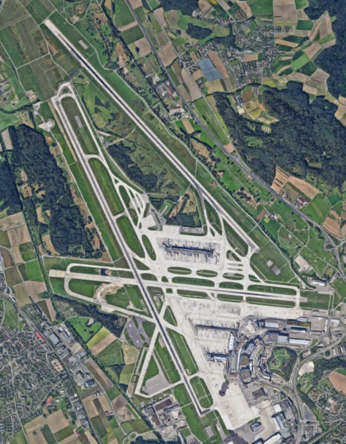
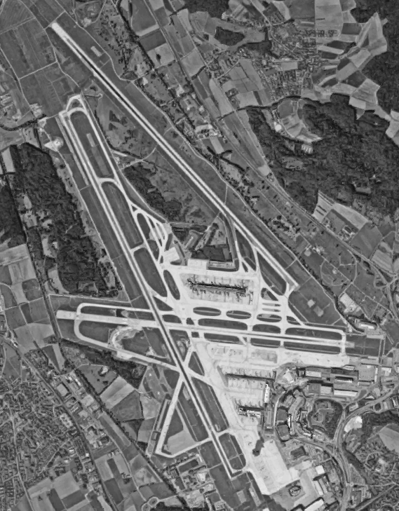
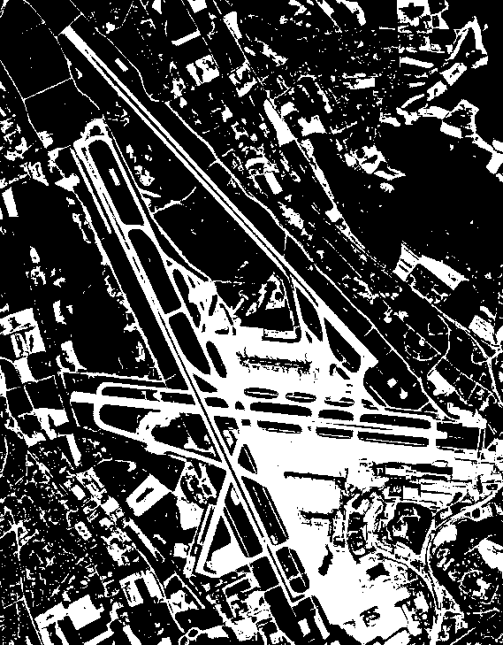
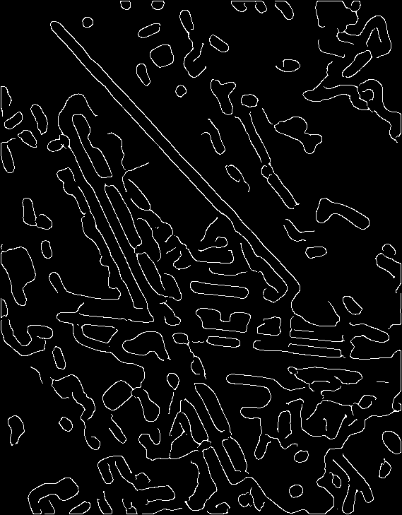
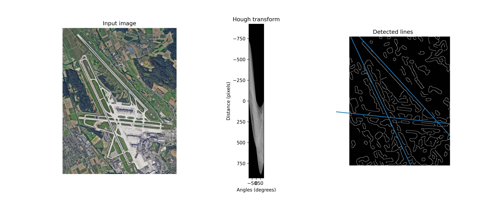
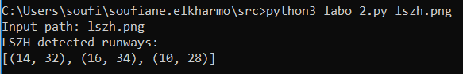

# Détecter l'orientation des pistes

### ligne de commande pour exécuter le programme
```python
python3 labo_2.py lszh.png
```
## Description de ma procédure

1. tout d’abord, j’ai lu l’image en rgb
## Image Originale



2. J’ai effectué la transformation de l’image en gris



4. Effectué la binarisation de l’image de couleur grise



3. J’ai appliqué la fonction Canny pour déterminer les contours 



4. Application de la fonction hough_line_peaks après avoir préparé les données d’angle via np.linspace et l’utilisation de la fonction hough_line en passant les coins à calculer la transformée.

5. La fonction me retourne un point d’angle. Étant une droite, si je trouve l’anclation d’un point, pour trouver l’autre angle, il suffit d’ajouter 180 degrés.



6. Ci-dessous, mon programme a identifié 3 pistes avec les angles suivants : 




## Merci beaucoup pour le cours que vous nous avez donné